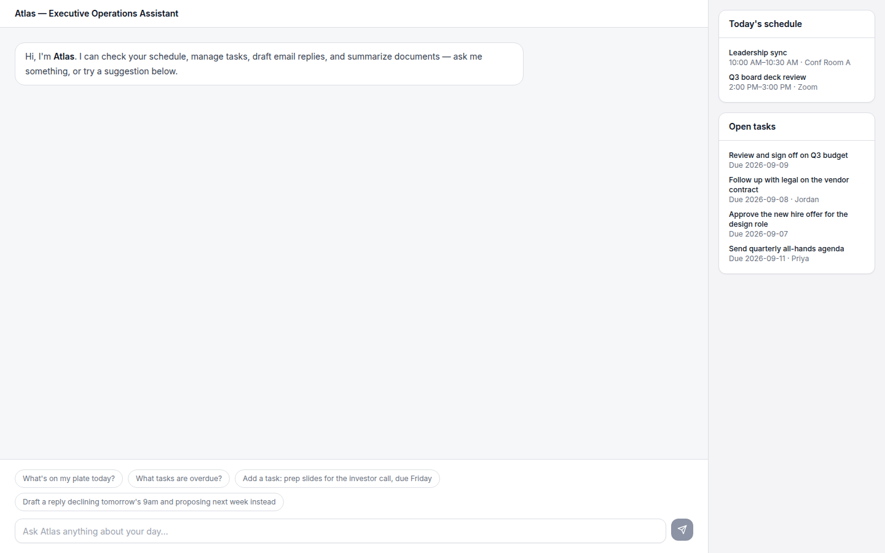

# Testing Atlas — step by step

This walks through installing Executive AI Operations Assistant ("Atlas") from a clean clone,
seeding it with real data, and exercising the actual ReAct tool-calling loop in the chat UI —
split into what needs an AI provider key and what doesn't, so you know exactly what you're
looking at each step of the way.

Everything below is verified against the code as it exists in this repo (`lib/agent/run.ts`,
`lib/tools/*`, `lib/ai/generate.ts`, `.env.example`, the test files) — not just the README's
summary of it — so if something here and the README ever disagree, this file is describing what
actually runs.

**Prerequisites:** Node.js 18.18+ (22 recommended — it's what CI uses), npm.

## What needs an AI provider key, and what doesn't

| To do this... | Needs an AI provider key? |
|---|---|
| Install, migrate, seed the database, and look at the seeded data | No |
| Load `/assistant` and see the sidebar (Today's schedule, Open tasks) | No — the sidebar reads the database directly (`GET /api/schedule`, `GET /api/tasks`), no LLM involved |
| Send **any** message to Atlas in the chat box | **Yes**, always |
| `npm test`, `npm run lint`, `npm run typecheck`, `npm run build` | No |

That "always" is worth being precise about: unlike keyword-matched demos, there's no fast path
here. `lib/agent/run.ts`'s loop calls the configured AI provider (`generateText`) as its very
first step for *every* message, purely to decide whether to call a tool and which one — even
"hi" costs one LLM call. If no provider is configured, that call throws immediately, before any
tool is ever attempted (exactly what that looks like is in Part 2).

## Part 1 — Install and look at the real seed data (no AI key needed yet)

```bash
git clone https://github.com/ubaidslab/Executive-AI-Operations-Assistant.git
cd Executive-AI-Operations-Assistant
npm install
cp .env.example .env.local
npm run db:migrate
npm run db:seed
npm run dev
```

A few notes on what those last three actually do:

- **`npm run db:migrate`** (`tsx lib/db/migrate.ts`) creates the three tables — `events`,
  `tasks`, `drafts` — with `CREATE TABLE IF NOT EXISTS`, so it's safe to run anytime. You can
  technically skip it on a first clone: `npm run db:seed` calls that same `runMigrations()`
  function itself before inserting anything. It's useful as its own script when you want the
  schema recreated without inserting any seed rows.
- **`npm run db:seed`** (`tsx lib/db/seed.ts`) inserts, into a local SQLite file at `./local.db`
  (`DATABASE_URL=file:./local.db` by default), data timed relative to the moment you run it:
  - **4 calendar events** — "Leadership sync" and "Q3 board deck review" both today, a "1:1 with
    Sarah (VP Sales)" tomorrow, and an "Investor update call" two days out.
  - **5 tasks** — four **open** ("Review and sign off on Q3 budget" due tomorrow; "Follow up
    with legal on the vendor contract" due today, assigned to Jordan; "Approve the new hire offer
    for the design role" due **yesterday**, i.e. the one task that's actually overdue; "Send
    quarterly all-hands agenda" due in 3 days, assigned to Priya) and one already **done**
    ("Review last week's board minutes", due 3 days ago).
  - **0 drafts** — the `drafts` table starts empty. It only gets rows once you actually use
    `draft_email_reply` or `summarize_document` from the chat (Part 3).
  - The script prints `Seeded 4 events and 5 tasks.` plus two suggested first prompts.
- **It's additive, not a reset.** `seed.ts` only runs `INSERT`s — it never clears existing rows
  first. Running `npm run db:seed` a second time doubles the events and tasks instead of
  replacing them. For a clean slate, delete the database file first (`rm local.db`) and reseed.
- **The seed data is wall-clock-anchored, not perpetually "today."** Those dates are computed
  once, at the moment `db:seed` runs, and stored as fixed timestamps. If you seed now and come
  back several days later without reseeding, "Today's schedule" may show nothing — that's
  expected, not a bug. Reseed right before you record if you want the sidebar populated.

Open [http://localhost:3000](http://localhost:3000) — it redirects straight to `/assistant`
(`app/page.tsx`). Before typing anything, look at the right-hand sidebar: **Today's schedule**
and **Open tasks** should already be populated from the seed data above. That's proof the data
layer works independent of any AI provider — those two cards are direct `fetch("/api/schedule")`
/ `fetch("/api/tasks")` calls that hit the database and return, with no LLM in the loop at all.
One cosmetic note: the sidebar renders times in *your browser's* local timezone
(`toLocaleTimeString` with no timezone override), while the data itself is stored in UTC — so the
exact clock times you see may not match a screenshot taken in a different timezone; the events
themselves are still correct.

## Part 2 — Wire up an AI provider

Nothing in the chat box works without this. `AI_PROVIDER` in `.env.local` picks between two
supported values, both implemented in `lib/ai/generate.ts` — anything else throws
`Unknown AI_PROVIDER "..."`.

| Variable | Required? | Notes |
|---|---|---|
| `AI_PROVIDER` | No — defaults to `cloudflare` | `cloudflare` or `openai` |
| `CLOUDFLARE_ACCOUNT_ID`, `CLOUDFLARE_API_KEY` | Only if using Cloudflare (the default) | [Free tier](https://developers.cloudflare.com/workers-ai/) — `.env.example` calls this out explicitly |
| `CLOUDFLARE_MODEL` | No — defaults to `@cf/meta/llama-3.1-8b-instruct` | Needs to be a model with solid instruction-following — the whole loop depends on it reliably emitting the JSON action format |
| `OPENAI_API_KEY` | Only if `AI_PROVIDER=openai` | Unlike the Cloudflare block above, `.env.example`'s OpenAI section carries no "free tier" note — budget for this as a paid API account unless you already have OpenAI credit |
| `OPENAI_MODEL` | No — defaults to `gpt-4o-mini` | |
| `OPENAI_BASE_URL` | No — defaults to the real OpenAI endpoint | Only change this if pointing at a different URL that implements the same chat-completions request/response shape |
| `DATABASE_URL`, `DATABASE_AUTH_TOKEN` | No | Only relevant for pointing at a remote Turso database instead of the local SQLite file |
| `NEXT_PUBLIC_SITE_URL` | No | Cosmetic — Open Graph preview image only, doesn't affect anything you're testing |

**Easiest path — Cloudflare Workers AI (free):**

1. Sign up / log in at [developers.cloudflare.com/workers-ai](https://developers.cloudflare.com/workers-ai/).
2. Grab your **Account ID** from the dashboard, and create an API token with Workers AI access.
3. In `.env.local`, fill in `CLOUDFLARE_ACCOUNT_ID` and `CLOUDFLARE_API_KEY`. Leave
   `AI_PROVIDER` as `cloudflare` (or set it explicitly) and `CLOUDFLARE_MODEL` at its default.
4. Restart `npm run dev` — Next.js only reads `.env.local` at process start.

**Alternative — OpenAI:** set `AI_PROVIDER=openai` and `OPENAI_API_KEY` in `.env.local`, restart
the dev server.

**What it looks like if you skip this and send a message anyway:** a clear, honest error comes
back as Atlas's reply — no crash, no silent hang. With no Cloudflare key configured, for example,
the assistant's next bubble is the literal text `Cloudflare Workers AI is not configured. Set
CLOUDFLARE_ACCOUNT_ID and CLOUDFLARE_API_KEY (see .env.example).` — with no tool badge under it,
because the failure happens before any tool call is attempted. That's a genuinely useful thing to
show in a recording too — it proves the "no key configured" path is handled deliberately, not
left to blow up.

## Part 3 — Watching the ReAct loop actually run

This is the core of the demo. Send a message, and watch for a small pill badge with a wrench
icon appearing under Atlas's reply — that's `app/assistant/page.tsx` rendering each `tool_call`
step the agent took (from `lib/agent/run.ts`'s `steps` array, returned alongside the reply by
`POST /api/assistant`). No badge under a reply just means the model answered directly without
calling a tool — normal for something like "hi", but if you asked about your actual schedule or
tasks and got a confident answer with no badge, that's the model guessing instead of calling
`get_schedule`/`list_tasks` (the system prompt explicitly tells it not to) — rephrase or nudge it.

The chat box has four built-in suggestion chips (visible before you send your first message) —
these are the most reliable prompts to use, since they're literally what the product ships with:

| Prompt (click the chip, or type it) | Tool(s) it should call |
|---|---|
| "What's on my plate today?" | `get_schedule` |
| "What tasks are overdue?" | `list_tasks` (overdue filter — should surface exactly the one "Approve the new hire offer" task from the seed data) |
| "Add a task: prep slides for the investor call, due Friday" | `create_task` — check the sidebar's Open tasks card, it refreshes after every reply, and the new task should appear |
| "Draft a reply declining tomorrow's 9am and proposing next week instead" | `draft_email_reply` |

A few more, to exercise the tools those four don't cover:

- **`complete_task`** — "Mark 'Follow up with legal on the vendor contract' as done." The model
  doesn't have that task's id yet, so watch for it calling `list_tasks` first, then
  `complete_task` — two badges, not one. This multi-step chaining is real, not scripted — see
  `lib/agent/run.test.ts`'s "chains multiple tool calls" case for the same behavior under test.
- **`reschedule_event`** — "Move my 1:1 with Sarah to 3pm tomorrow." Should chain similarly (find
  the event, then reschedule it), and the new end time will land exactly 30 minutes after the new
  start — `reschedule_event` preserves the original duration automatically
  (`lib/tools/date-utils.ts`'s `computeRescheduledEnd`); it doesn't ask the model to compute it.
- **`summarize_document`** — paste a few paragraphs of any text and ask "Summarize this and pull
  out the action items."

A few honest caveats, all about the model's own behavior rather than a bug in this repo:

- **Exact tool sequencing isn't guaranteed.** This is a hand-rolled loop that asks the model to
  emit one JSON action per turn (see the README's Architecture section for why) — a smaller model
  can occasionally phrase the JSON slightly wrong, skip a tool it should've used, or take an extra
  step. `lib/agent/parse.ts` absorbs malformed output by treating it as a final answer instead of
  crashing, so worst case you get a plain text reply with no tool badge instead of an error — try
  rephrasing.
- **`draft_email_reply` and `summarize_document` each cost *two* LLM calls, not one** — one for
  the agent loop to decide to call the tool, and a second, separate call made *inside* the tool
  itself (`lib/tools/executors.ts`) to actually generate the draft/summary text. Both draw on
  whichever provider you configured in Part 2; there's no separate key for this.
- **The chat UI's tool badges show tool names only** — not the arguments passed in or the raw
  result. To see those (useful for proving on camera that a tool actually ran with real arguments
  and returned real data), open your browser DevTools' Network tab, find the `POST
  /api/assistant` request, and look at its JSON response — the full `steps` array is there, with
  each `tool_call`'s `args` and each `tool_result`'s `result`.
- **The loop gives up after 5 tool-call iterations** in one request, returning a plain "I wasn't
  able to finish that within my tool-call budget" message rather than looping forever — unlikely
  to come up with the prompts above, but worth knowing if a more open-ended ask doesn't resolve.

For reference, here's the layout before you've sent any message (`docs/screenshots/assistant.png`,
also used in the README) — sidebar populated, no tool badges yet since nothing's been asked:



## Part 4 — `npm test`

```bash
npm test            # vitest run — one-shot
npm run test:watch  # same tests, interactive re-run on save
```

No AI provider key needed, and it doesn't touch `local.db` — `vitest.config.ts` points
`DATABASE_URL` at `file::memory:` for the whole run, a fresh in-memory database per process.
Five test files, all real logic (nothing mocked except the one thing that genuinely can't run in
CI without a paid/free key):

| File | What it actually checks |
|---|---|
| `lib/agent/parse.test.ts` | The model-output parser: plain tool-call JSON, plain final-answer JSON, code-fence stripping (both `` ```json `` and bare `` ``` ``), missing `args` defaulting to `{}`, and the fallback that treats unparseable/non-matching output as a final answer instead of throwing |
| `lib/agent/run.test.ts` | The loop end to end against a real (in-memory) database — **only the LLM call itself is mocked**, everything else (parsing, tool execution, control flow) runs for real: a single tool call finishing in one step, a chained multi-tool-call request, a tool execution error (unknown task id) getting surfaced back into the loop instead of crashing, the 5-iteration hard cap kicking in on a model that never stops calling tools, and a plain final answer when no tool is needed at all |
| `lib/rate-limit.test.ts` | The fixed-window limiter: allows up to the limit, blocks over it, resets once the window elapses |
| `lib/tools/date-utils.test.ts` | `resolveDateKeyword` (today/tomorrow/yesterday, case-insensitivity, explicit dates, month/year boundaries, throwing on nonsense like "next friday") and `computeRescheduledEnd`'s duration-preserving math |
| `lib/validate/conversation.test.ts` | Request-shape validation: accepts a well-formed conversation, rejects a non-array body, an empty array, too many turns, an invalid role, empty content, and content over the length limit |

`npm run lint` (ESLint) and `npm run typecheck` (`tsc --noEmit`) are also real, working scripts
worth running before calling anything "done" — both are part of CI (next section).

## Part 5 — CI

`.github/workflows/ci.yml` runs on every push and pull request to `main`, on `ubuntu-latest` with
Node 22, in this order: `npm ci` → `npm run lint` → `npm run typecheck` → `npm test` → `npm run
build`. It sets its own `DATABASE_URL=file:./ci.db`, so it never depends on anything seeded
locally, and it configures no AI provider secrets at all — consistent with `npm test` not needing
one. The badge at the top of the README links to this workflow's run history.

---

That's the whole surface: install → seed → inspect without any key → configure a provider → drive
the actual tool-calling loop from the chat box → run the same checks CI runs. Everything above is
grounded in the current code, not a summary of it — if a future change to `lib/agent/`,
`lib/tools/`, or `.env.example` makes any of this stale, that's what to re-check against.
